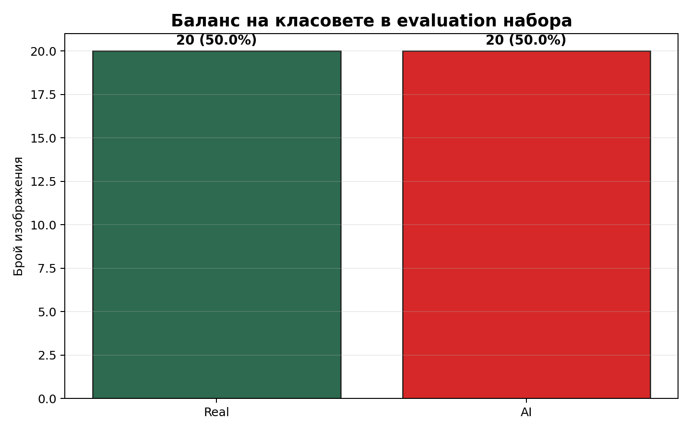
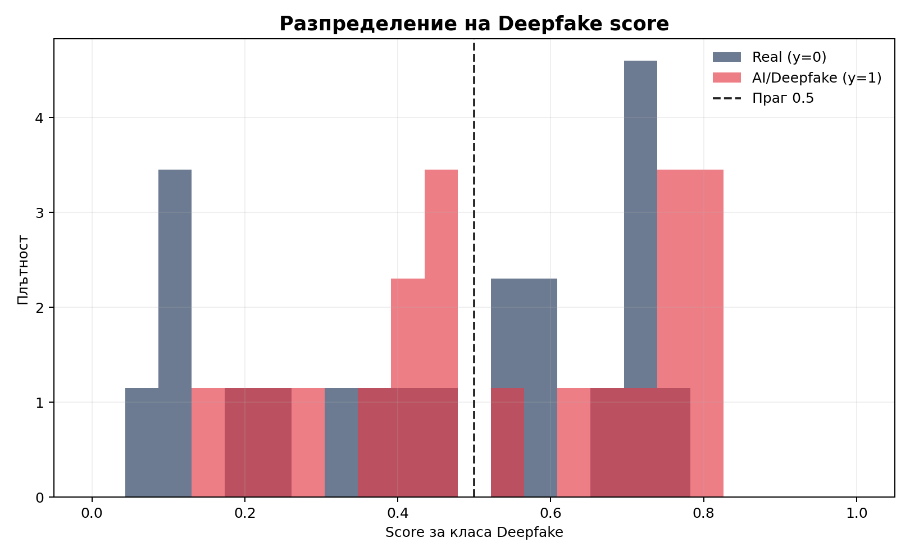
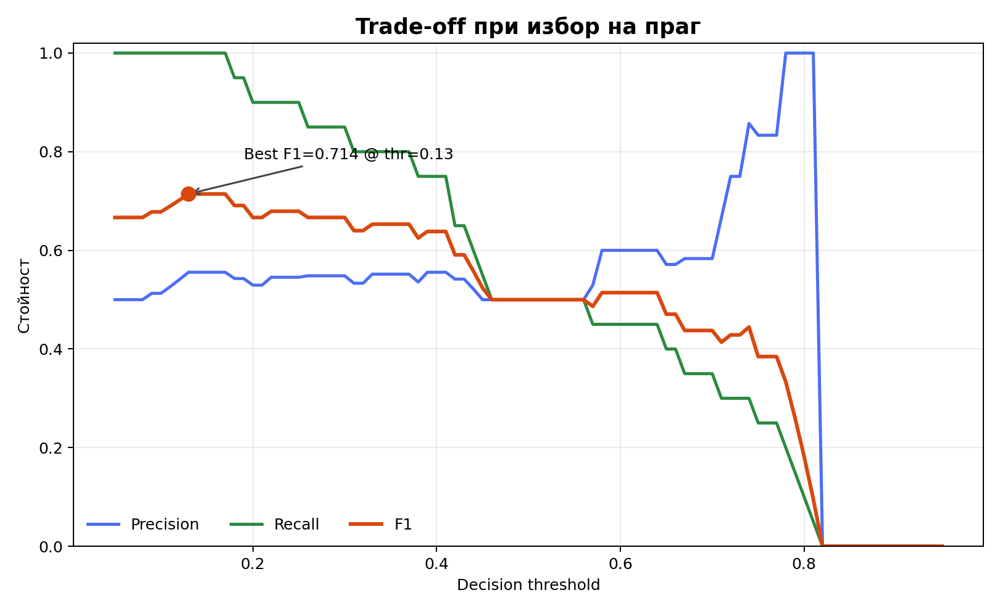
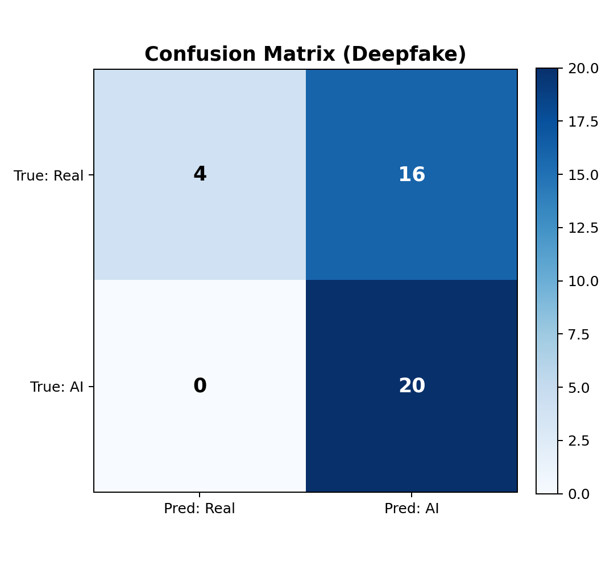

## Проблемът


::: {.columns}
::: {.column width="100%"}
{fig-alt="AI usage chart" width="60%" style="display:block; margin:0 auto;"}
:::
:::

## Какво изградихме

::: {.columns}
::: {.column width="55%"}
::: {.kicker}
Решение
:::

- Един endpoint: `/detect/image`
- Три независими модела в паралел:
  - Deepfake (ResNet-18)
  - NSFW
  - Flux (SigLIP)
- UI за live threat feed + страница „Try It“

::: {.two-column-note}
Приоритетът е надежден сигнал и ясна интерпретация, а не „черна кутия“.
:::
:::
::: {.column width="45%"}
```{mermaid}
flowchart TD
  A[Upload image] --> B[FastAPI /detect/image]
  B --> C[Deepfake model]
  B --> D[NSFW model]
  B --> E[Flux model]
  C --> F[Combined JSON result]
  D --> F
  E --> F
  F --> G[Dashboard + Threat feed]
```
:::
:::

## Как обучихме Deepfake модела

::: {.kicker}
Тренировъчен pipeline
:::

- Данни: Kaggle `muhammadbilal6305/200k-real-vs-ai-visuals-by-mbilal`
- Stratified split: 80/20 (validation = $20\%$)
- Backbone: pretrained ResNet-18, бинарен head ($512\rightarrow1$)
- Loss: BCEWithLogitsLoss + `pos_weight`
- Optimizer: AdamW, $lr=3\cdot10^{-4}$, weight decay $10^{-4}$
- Аугментации: RandomResizedCrop, HorizontalFlip, ColorJitter
- Запазваме checkpoint с най-добър validation $F_1$

\[
p(y=1\mid x)=\sigma(f_\theta(x)),\qquad
\mathcal{L}_{\text{BCE}}=-\frac{1}{N}\sum_{i=1}^{N}\left[y_i\log p_i+(1-y_i)\log(1-p_i)\right]
\]

## Какво показват данните

::: {.metric-grid}
<div class="metric-card"><div class="metric-title">Оценени изображения</div><div class="metric-value">40</div></div>
<div class="metric-card"><div class="metric-title">Real</div><div class="metric-value">20</div></div>
<div class="metric-card"><div class="metric-title">AI</div><div class="metric-value">20</div></div>
<div class="metric-card"><div class="metric-title">Best F1 (demo sample)</div><div class="metric-value">0.714</div></div>
:::

::: {.columns}
::: {.column width="48%"}
{fig-alt="Баланс на класовете" width="100%"}
:::
::: {.column width="52%"}
{fig-alt="Разпределение на score" width="100%"}

::: {.two-column-note}
Виждаме припокриване около прага 0.5, затова правим tuning според риска.
:::
:::
:::

## Резултати и tuning на праг

::: {.columns}
::: {.column width="52%"}
{fig-alt="Threshold trade-off" width="100%"}
:::
::: {.column width="48%"}
{fig-alt="Confusion matrix при най-добър праг" width="100%"}

- Най-добър $F_1 \approx 0.714$ при $\tau\approx 0.13$ (demo sample).
- Получаваме recall $=1.0$ за AI, но цената е повече false positives.
- За production: прагът се избира по policy (strict vs balanced mode).
:::
:::

## Как протича демото на живо

1. Качваме изображение в страницата "Try It".
2. Пускаме паралелно deepfake + nsfw + flux.
3. Връщаме структуриран JSON с per-model score и label.
4. Показваме събитието в dashboard threat feed.

\[
y_{global}=\max(y_{deepfake},y_{nsfw},y_{flux})
\]

Всеки анализ се логва с SHA-256 хеш за проследимост и analytics.

## Roadmap след хакатона

::: {.kicker}
Какво следва
:::

- Два режима на праг: `strict` и `balanced`
- По-голям validation benchmark + калибрация по домейн
- Drift и latency мониторинг в production
- Policy слой за автоматични действия при висок риск

## Благодарим

### Въпроси?

Контакт: екип SALUS, FMI{CODES}
