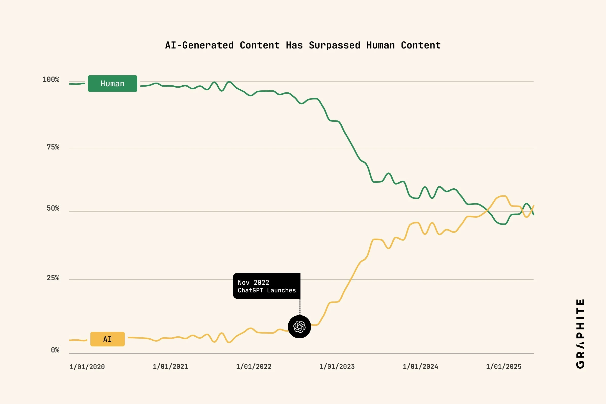
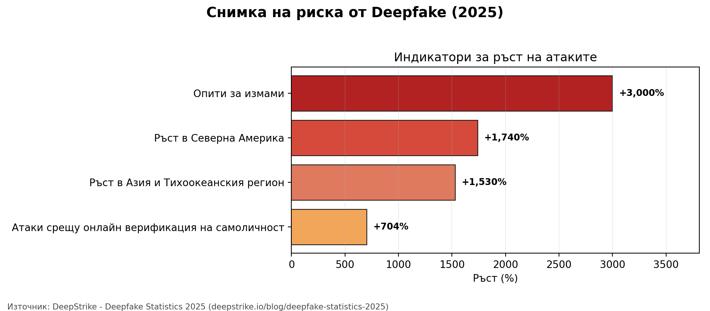
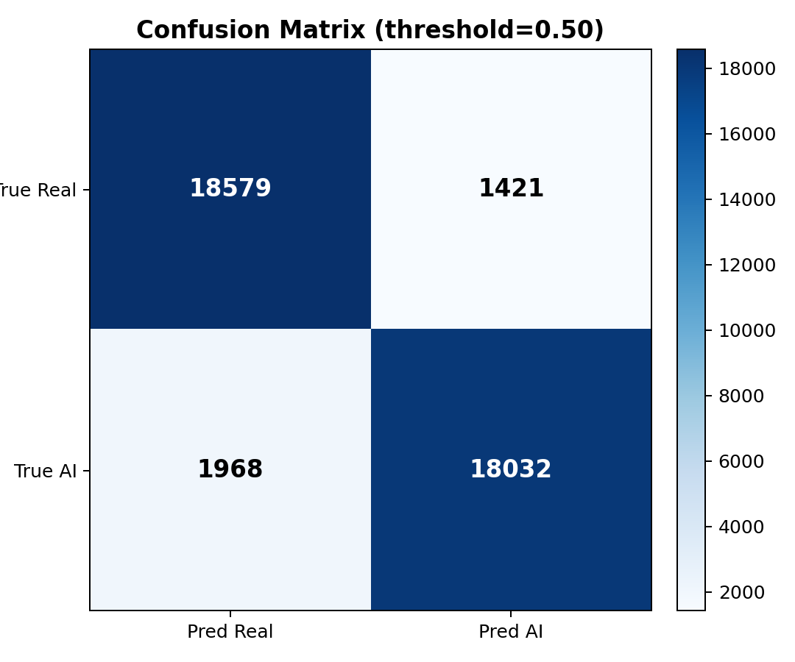

## Проблемът


::: {.columns}
::: {.column width="100%"}
{fig-alt="AI usage chart" width="90%" style="display:block; margin:0 auto;"}
:::
:::

## Рискове и вреди
::: {.columns}
::: {.column width="100%"}
{fig-alt="Графика за риска от deepfake" width="100%"}

::: {.two-column-note}
Източник: [DeepStrike, "Deepfake Statistics 2025: AI Fraud Data & Trends"](https://deepstrike.io/blog/deepfake-statistics-2025), обновено на 2025-09-08.
:::
:::
:::

## Решение
::: {.columns}
::: {.column width="30%"}
{fig-alt="Преди SALUS" width="100%"}
:::
::: {.column width="30%"}
{fig-alt="След SALUS" width="100%"}
:::
::: {.column width="40%"}
- Засича вредни изображения
- Заменя ги с цензурирани версии
- Работи за Deepfakes и NSFW съдържание
:::
:::

## Решение 

::: {.columns}
::: {.column width="25%"}
:::
::: {.column width="75%"}
```{mermaid}
flowchart TD
  A[Response Intercepting Proxy] --> B[Image detection API]
  B --> C[Deepfake model]
  B --> D[NSFW model]
  B --> E[Flux model]
  C --> F[Combined JSON result]
  D --> F
  E --> F
  F --> H[Censored image response]
```
:::
:::

## Реализация
- FastAPI backend с три ML модела (Deepfake, NSFW, Flux)
- React frontend за демонстрация и dashboard
- Proxy слой за интеграция в мрежата

Deepfake моделът е обучен от нас върху над 200,000 изображения.

Постигаме 92% точност с модел от само 12M параметри.

## Резултати

::: {.columns}
::: {.column width="100%"}
{fig-alt="Confusion matrix при най-добър праг" width="100%"}
:::
:::


## Roadmap след хакатона

::: {.kicker}
Какво следва
:::

- Два режима на праг: `strict` и `balanced`
- По-голям validation benchmark + калибрация по домейн
- Drift и latency мониторинг в production
- Policy слой за автоматични действия при висок риск

## Благодарим

### Въпроси?

Контакт: екип SALUS, FMI{CODES}
